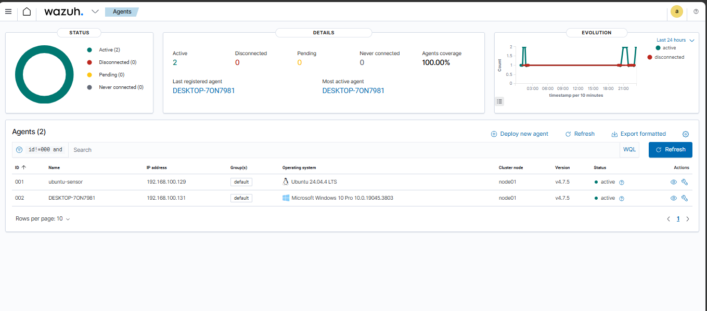
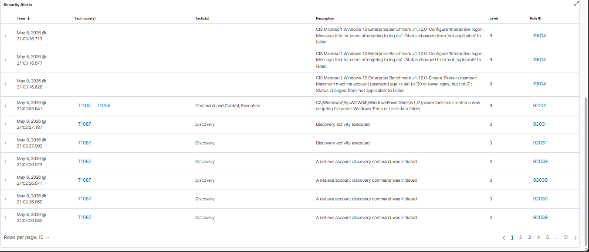
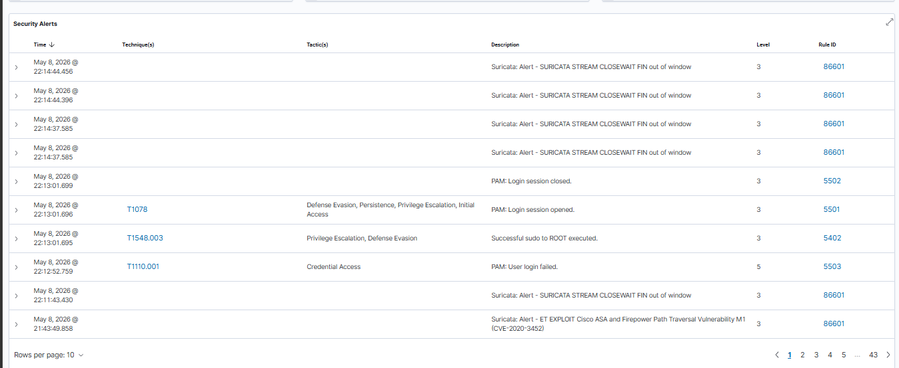
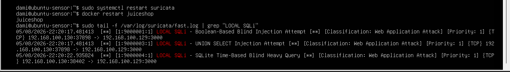

# Homelab Security Lab

A hands-on detection engineering homelab built to develop practical SOC skills and demonstrate real-world threat detection capabilities. This project covers network intrusion detection, endpoint telemetry, attack simulation, and custom rule development — all documented as a portfolio for entry-level SOC/detection engineering roles.

---

## Architecture

| VM | OS | Role | IP |
|---|---|---|---|
| wazuh-server | Ubuntu Server 22.04 LTS | Wazuh SIEM (all-in-one) | 192.168.100.128 |
| ubuntu-sensor | Ubuntu Server 24.04 LTS | Wazuh agent, Suricata IDS, OWASP Juice Shop | 192.168.100.129 |
| kali-attacker | Kali Linux | Attack simulation | 192.168.100.130 |
| windows-endpoint | Windows 10 Pro | Wazuh agent, Sysmon endpoint telemetry | 192.168.100.131 |

All VMs run on VMware Workstation Pro (free) on a Windows PC, connected via an isolated VMnet2 NAT network (`192.168.100.0/24`).



---

## Lab Phases

### Phase 1 — Lab Setup
VMware Workstation Pro configured with isolated VMnet2 network. Four VMs provisioned: Wazuh server, Ubuntu sensor, Kali attacker, and Windows endpoint.

### Phase 2 — Wazuh SIEM
Wazuh 4.7.5 all-in-one stack deployed on Ubuntu Server 22.04. Includes Wazuh Manager, Wazuh Indexer (OpenSearch), and Wazuh Dashboard. Accessible via HTTPS on `192.168.100.128`.

### Phase 3 — Wazuh Agents
Wazuh agents enrolled on both `ubuntu-sensor` (Linux) and `windows-endpoint` (Windows 10). Both reporting to the Wazuh manager with version-matched agents (4.7.5).

### Phase 4 — Suricata IDS
Suricata 7.x deployed on `ubuntu-sensor` monitoring interface `ens33`. Configured with `HOME_NET: 192.168.100.0/24`. Integrated with Wazuh via `eve.json` log collection. Emerging Threats ruleset active.

### Phase 5 — OWASP Juice Shop
Vulnerable web application deployed via Docker on `ubuntu-sensor` (`port 3000`). Serves as the primary attack target for structured attack simulations.

### Phase 6 — Sysmon Endpoint Telemetry
Sysmon installed on `windows-endpoint` using Olaf Hartong's modular `sysmonconfig.xml` (chosen for its detection-focused rule set). Wazuh agent configured to collect from `Microsoft-Windows-Sysmon/Operational` event channel. Immediately producing MITRE-mapped alerts including T1087 (Account Discovery) and T1548 (Abuse Elevation Control Mechanism).



### Phase 7 — Attack Simulation
Structured attack campaigns from `kali-attacker` against Juice Shop:

- **Nikto** — Web server reconnaissance (8,918 requests, 28 findings)
- **Gobuster** — Directory enumeration (discovered `/ftp`, `/api`, `/assets`)
- **sqlmap** — SQL injection testing (confirmed boolean-based blind SQLi on `q` parameter, SQLite backend identified, 65 HTTP 500 errors generated)



### Phase 8 — Custom Suricata Detection Rules
**Detection gap identified:** The default Emerging Threats ruleset fired on HTTP anomalies and known CVE signatures but produced zero SQL injection-specific detections during the sqlmap run.

Four custom rules written to close the blind SQLi detection gap:

| SID | Rule | Technique |
|---|---|---|
| 9000001 | Boolean-Based Blind Injection Attempt | Blind SQLi |
| 9000002 | Time-Based Blind Injection SLEEP | Time-based blind SQLi |
| 9000003 | UNION SELECT Injection Attempt | UNION-based SQLi |
| 9000004 | SQLite Time-Based Blind Heavy Query (randomblob) | SQLite-specific blind SQLi |

Rules stored in `/var/lib/suricata/rules/local.rules`. On retest, all three active techniques were detected in real time.



---

## MITRE ATT&CK Coverage

| Technique | ID | Source |
|---|---|---|
| Account Discovery | T1087 | Sysmon / Wazuh (Windows) |
| Abuse Elevation Control Mechanism | T1548.003 | Sysmon / Wazuh (Windows) |
| Valid Accounts | T1078 | Wazuh PAM rules (Linux) |
| Credential Access – Brute Force | T1110.001 | Wazuh PAM rules (Linux) |
| Web Application Attack – SQLi | Custom | Suricata local.rules |

---

## Tech Stack

| Tool | Version | Purpose |
|---|---|---|
| VMware Workstation Pro | Latest (free) | Hypervisor |
| Wazuh | 4.7.5 | SIEM / EDR |
| Suricata | 7.x | Network IDS |
| Sysmon | Latest | Windows endpoint telemetry |
| OWASP Juice Shop | Latest | Vulnerable web app target |
| Docker | Latest | Container runtime |
| Kali Linux | Latest | Attack simulation |
| sqlmap | 1.10.4 | SQL injection testing |
| Nikto | Latest | Web server scanner |
| Gobuster | 3.8.2 | Directory enumeration |

---

## Architecture Decision Record

See [architecture-decision-record.md](architecture-decision-record.md) for the full history of architectural decisions including the migration from macOS/UTM to Windows/VMware.

---

## Repository Structure

```
homelab-security-lab/
├── README.md
├── architecture-decision-record.md
├── screenshots/
│   ├── 01-vmware-vms.png
│   ├── 02-agents-active.png
│   ├── 03-custom-sqli-rules.png
│   ├── 04-wazuh-security-alerts.png
│   └── 05-windows-sysmon-alerts.png
└── phase-docs/
    ├── phase-1-lab-setup.md
    ├── phase-2-wazuh-siem.md
    ├── phase-3-wazuh-agents.md
    ├── phase-4-suricata-ids.md
    ├── phase-5-juice-shop.md
    ├── phase-6-sysmon-endpoint.md
    ├── phase-7-attack-simulation.md
    └── phase-8-custom-detection-rules.md
```

---

## Author

Damilola Fakorede — Entry-level SOC Analyst  
MSc Computing (Internet Technology & Security) — Distinction  
CompTIA Security+  
[GitHub](https://github.com/damifk) | [LinkedIn](https://linkedin.com/in/damilola-fakorede)
